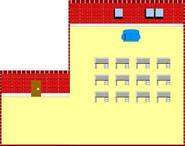
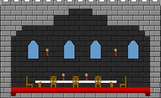
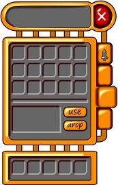
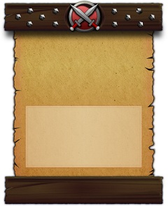
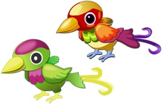
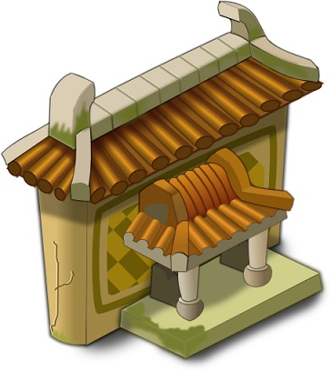

程序员开发独立游戏，美术资源是永远的痛。

 1. 忽悠不来美术合伙人
 2. 免费资源不符合风格，不可以在商业用途中使用
 3. 外包贵，一分钱一分货，找便宜的可能不靠谱

在财务状况不允许的情况下，外包不算是一个很好的决策。那么剩下的路只有一条，**be an artist**。这很疯狂，编程花了好几年，才达到手熟的境界，从头开始学画画，大概也需要用掉好几年的时间才能出师，而且多数程序员都认为自己没有右脑美术天赋，完全是个画瞎子。

> *Yipit*的创始人，之前做金融行业，然后打算创立一个科技公司。他将创意原型外包出去，然后花了九个月的时间，明白了外包以及找一个CTO合伙人是不靠谱的想法，在业务根本没有开始的条件下。别无选择的，他只好痛苦的开始学习编程，三个月后，他的网站上线了，同时还写了一本书。

隔行如隔山，但不代表不能从零开始学习。虽然我和大家一样，是画瞎子，右脑后脑勺甚至比左脑小一些，平时画个简笔画也奇丑无比，但我还是决定重新开始学习。这一次我没从**学会画画**这个目标开始，而是尝试去**制作美术资源**。

----------

## 制作美术资源 ##
制作美术资源这个目标，比学会画画更容易实现，而且也更不需要右脑功能。这是什么意思呢？单从字面讲，就是把一个创意发散的境界，描述成一个规规矩矩的工业输出流程。从操作上讲，画画是拿笔挥毫泼墨，形状上比较自由，颜色是一笔笔画上去的，深浅不一。而制作美术资源，形状一般都倾向简单和组合，同时颜色是填充式的，更容易左脑理解。  
不用抽象的词汇描述了，可以先从[供独立游戏开发者参考的2D美工教程](http://gamerboom.com/archives/39884)开始，我看过以后如醍醐灌顶，原来美术方面的工作可以从这样一个方向开始。

> 我先浏览了这个教程，然后照着其中一个案例做了一下，很容易的成功了，那种感觉非常好。整个过程就是做出几个形状，排列组合，然后填充不同的颜色，或者是渐变，或者调整一下透明和模糊。  
我以前也看过ps类的教程，但是都没有做出来过，因为需要掌握的技巧和概念太多了。在这个教程，在inkscape中，你只要掌握**制作形状**，掌握渐变，掌握模糊就已经可以开始了，这些简单的技巧表达了光影效果，绘画中的层次感的来源。

我很兴奋的想看看关于inkscape更多的使用方式，然后我找到了[一系列的视频教程](http://www.youku.com/playlist_show/id_3142703.html)，如饥似渴的学习每一篇。在这里我学到了*tile clone*, *patten along path*, *jitter*, *texture blender*等相对高级又比较好用的操作，也初步对如何制作图像的立体感有了基本的认识。

> 完成入门阅读后，就要动手临摹，否则也是纸上谈兵，空谈误国。我先是从**opengameart**找了一些喜欢的资源临摹，**opengameart**的资源风格偏怀旧，像素画居多。我临摹了几幅，场景的和UI的都有。  
  
UI相对容易临摹，而且更容易制作出非常真实的效果。接着我发现**花瓣网**上的素材更丰富更现代，我从中临摹了许多UI素材，以及复杂的物件。  

----------

不得不说的是，临摹制作的过程中，我产生了一些工作难度，工作量和工作效率的看法，我想这会对我找个美术合伙人或者外包的时候有所帮助。

 1. 一个UI组件，我大概需要花费两个小时进行制作，如果一个界面上组件多一些，工时大概也能推导出来。所以对靠谱的外包，应该如何付费，有了靠谱的认识。人家出来混也是要吃饭的。
 2. UI素材比物件素材好做很多，主要是因为形状更简单，颜色组合也更简单。UI素材我看着就能制作出来了。
 3. 稍微有点难度的物件素材，我必须把原图铺到最下层对着线条绘制，然后在上色。操作上把这叫做图片矢量化。
 4. 创作能力有限，无法突破，毕竟前面的学习其实都没有用到右脑，用软件临摹得再像，也无法随意的制作自己全新的美术资源，在喜欢的素材上二次创作倒是可以。
 5. 无论如何，总算开始入门了。
