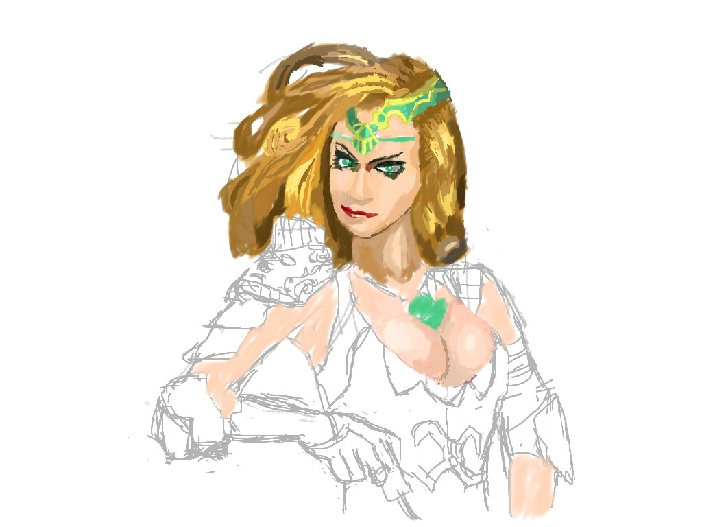
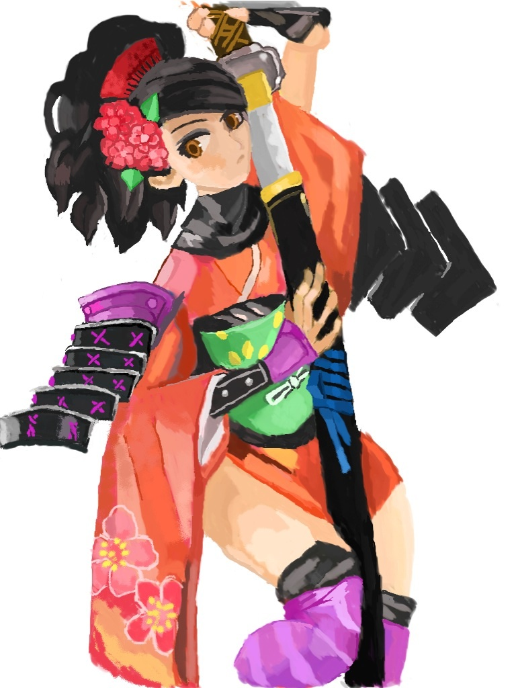

继[开始画画](http://hwh008.github.io/game-art/draw-by-hand.html)以后，又抽空画了一些。临摹的关键是注重比例，轮廓草图打的时好时坏。即使轮廓草图再差，经过仔细上色后，也能画出一幅有模有样的作品来。上色费的功夫越多，画面越像，画画其实是个苦力活，不过因为是右脑机制，除了手累点，其实蛮享受的。

----------
这个画了一半突然不想画下去了，因为心情不好。作画时最能看一个人内心是否宁静了，如果浮躁有心事的话，肯定干不了上色这种细致的苦力活。  
*四个小时*  

----------
又是一个姑娘，稍微把左护肩画小了。如果你能从**麦思涂鸦**看到这幅画的绘画流程，你就能明白从一个比小学生作品还次的蜡笔画一般的草图，转变到这种效果，需要多么苦力的上色处理了。  
*十个小时*  

----------

> *此篇博客长期更新*

>> Written with [StackEdit](http://benweet.github.io/stackedit/).