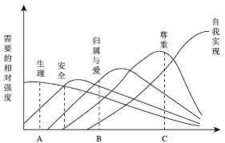

我想过很多次目标的问题，尝试过很多次，和90%的人一样，想过但想不出来，有关目标、梦想、理想之类的，哪怕想出一些相关的东西，最终也执行时间也不长，落地困难。

为此我很焦虑，焦虑得我说服自己，拥有明确目标和理想的家伙应该是极少数，毕竟那些有声望的家伙都是运气好才站在高处的。普通人的目标和理想总是模糊的，有外在干扰的，但只要活得够久，总会曲折的逼近最终目标。

可我还是焦虑，因为没有目标，我的工作和生活就变得相当空虚，因为我好像很闲，运气好，没经过太多劳碌的命运洗礼，又不爱玩游戏看剧看小说，结果就是有时间不会花，内心煎熬痛苦万分。

关于这点，我想我并不孤独。最近我又爆发了内心煎熬痛苦，所以找了知乎看看是否能得到什么提示。我确实找到了些好东西，也参考做了尝试。

* [How to Discover Your Life Purpose in About 20 Minutes](https://www.stevepavlina.com/blog/2005/01/how-to-discover-your-life-purpose-in-about-20-minutes/)
[翻译](http://www.voidcn.com/article/p-xlyzchfx-zr.html)

* [一个“梦想实践重度障碍者”的思考](https://www.mifengtd.cn/articles/thoughts-on-achieving-dreams.html)

第一个据说是大名鼎鼎的steve pavlina，个人成长学家？？？我是第一次听说，不过他的文章真是多。第二个是大名鼎鼎的褪墨的读者投稿，写得很好，这是心病，有治疗方案。

先讲这个梦想实践障碍的问题，里面说的很好。
> 我们的确可以更清楚自己的梦想，但并不存在这样一个节点，在此之前我不知道自己的梦想，一旦达到，我就瞬间领悟。对于梦想来说，我们都是逐渐清晰自己要做什么。对于所有在追求梦想的人来说，每一天都在路上。每一个当下都既是探索，又是答案；每一次行动都就既是过程，又是结果。“梦想”不是个静止的名词，而是一个连续的状态，在动态中不断发展和变化。

和我先前的有关人生目标总是模糊的感悟相近，但是更进一步精确，不会有那么一瞬间，或者天启，你能领悟自己的人生目标，然后为之努力奋斗。只要接受这点，焦虑症就又好了许多。

只要我还在探索，空虚寂寞冷的内心煎熬却依旧不能减轻，我这焦虑可是表里具有，难办啊。所以我依据20分钟发现人生目标的步骤，开始罗列这辈子时间想做的事情，这辈子时间想实现的事情。这个过程十分痛苦，根本不是花费20分钟到1小时的问题，整整花了我好几天的中午。

第1天我只能列出大概10条，接下来几天很痛苦的才总共憋出了25条。这个过程里，我对这个方法充满了犹豫与怀疑，我到知乎上看看真的有人能成功使用这个方法吗？确实有人成功有人失败，不少成功的都如文中所说哭出来了（也不知道哪个傻逼翻译原文翻译成哭出来的），我则和不成功的人那样被自己的内心的干瘪感到无语，难道我真是渣男废物没高尚的追求了？

幸运的是我还是坚持了下来，在26、27条之后，好像就想开了，一下子写下很多东西，时而抽象时而具体，多数时候都在用不同的写法描述一个概念，最后总共写了差不多60条，我觉得可以不用写了，总算松口气了。

我没有如文中说描述的需要哭出来，或者极其触动。我也没有写到100-200条那么多。我只是确认感觉到了，不需要继续罗列了，我觉得我这辈子就是想这样子的，在当下。所以我想我应该是成功的应用steve的方法找到了答案。

我不想展示我罗列的清单，因为有点丢脸，但是我愿意说下过程。

一开始，我罗列的是金钱，sex，和全球旅游，总之就是类似的这些东西，就是文章里所说的错误的答案。
> 通常它需要花费15-20分钟的时间来理顺你头脑中混杂的、被周围环境影响的人生目标，错误的答案会从你的心里和记忆中不断的冒出

这是第一层，也就是前10条的样子，享受简单而冲动的荷尔蒙，在这里我卡了一阵。随后应该算进入第二层，这里已经淡化了欲望的影响，集中在兴趣爱好、健康运动和求知欲上面，以及名声，我还在这里提到了孩子，但是我还没有意识到这是我最终目标的一部分。到这里我写下了26条的样子，而且写得很痛苦。

幸运的是，我可能快接近答案了，接下来我罗列的很快，我想释放压力，想解脱无聊的煎熬，我罗列了很多，时而具体时而抽象，但是都围绕着一个主题，我当下的核心理想。我发现我找到了，应该是找到了，我在第三层找到了我的核心理想，这个时候我已经罗列到了58条。
> 但是当正确的答案最终出现的时候，你就感觉到它好像来自于一个与其他完全不同的地方，这才是你的答案。

最终答案确实是来源于其他地方，整个过程有点像盗梦空间，每一层的梦境都是更深层的意识。

我找到的答案是， **我希望生活富足，生活充实，有完美的工作，陪伴孩子成长。** 你可能会想，这是什么鬼？但我可以说，这就是我自己的 **GHOST**。
> 当你找到一个独一无二的答案来回答你为什么而存在时，你会感觉到它会与你产生深深的共鸣。每一个词语对你仿佛都充满了力量，当你读这句话的时候，你会感觉充满了力量。找到你的人生目标简单，困难的是在日常工作中坚持它，不断的完善你自己来实现这个目标。

人生的最终目标应该是战略性质的，浅显但是又饱含了很多推导过程和缘由，并且可以展开详细描述。我的展开可以是，**我希望生活富足，没有还款压力，有足够的日常消费的被动经济来源；生活充实，有好几个熟练的业余爱好，懂得比常识更多一点的知识，空闲时间能总能充实度过；完美工作，可以睡懒觉，工作有挑战不枯燥，团队和谐优秀，人人都能根据事实引导项目发展，业绩评估公平合理，有实际市场需求和市场反馈；陪伴孩子成长，陪孩子阅读，手工，玩耍，成长。**

最后，谢谢我的老婆。

## 原理：马洛斯需求心理发展

我觉得steve的方法能找到答案，在一定程度上是符合马洛斯需求曲线那套理论的。人的需求就是人的目标，不同的需求有高低关系，但也有重合并存关系。

低级需求的满足急迫性高于高级需求，根据边际收益递减原理和个人的不同的需求阈值偏好，一定程度满足低级需求后，人就会开始追求高一级的需求，所以很多人工作一段时间后就开始追求最高的需求-自我实现。因为他真的一定程度的填充了生理需求、安全需求、归属需求、尊重需求，所以最高需求圣杯出现在目光所及之处。

我在寻找答案的过程中，罗列的答案也经历了覆盖低级需求到高级需求的过程。第一层次的答案明显是覆盖生理需求和安全需求，第二层次的答案其实是自尊、成就类的需求。直到第三层次发现最终答案，才是完成自我实现，同时也覆盖了整个马洛斯需求层级。
