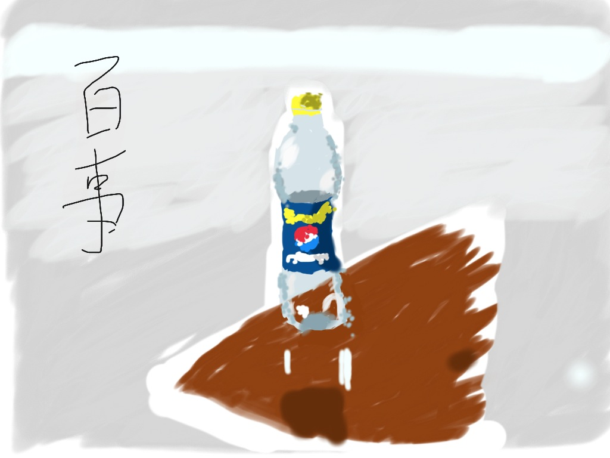
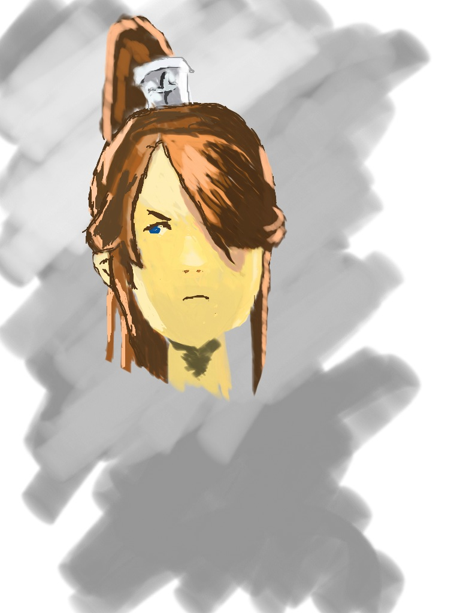
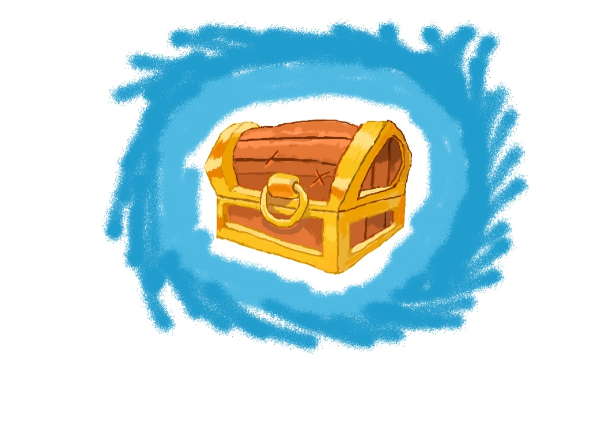
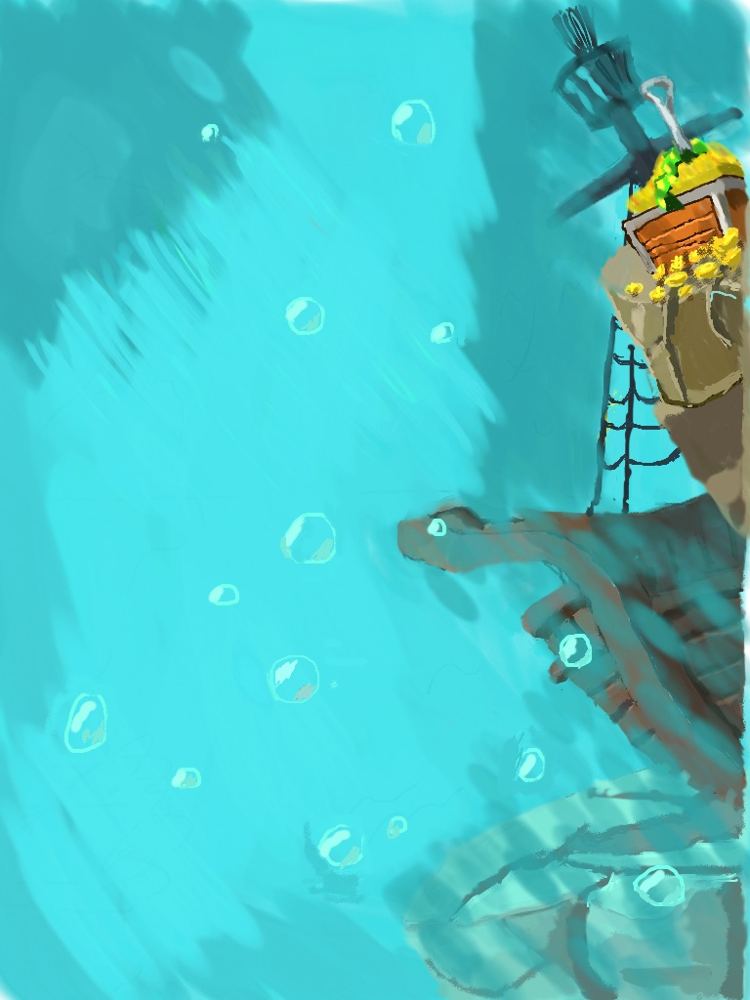
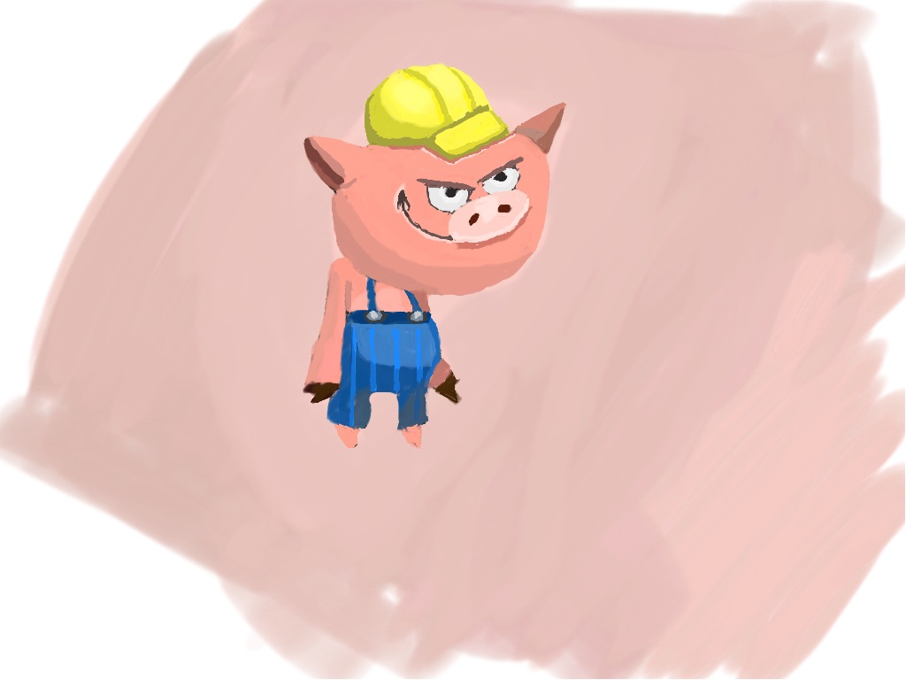

看过[五天学会绘画](http://hwh008.github.io/game-art/draw5days.html)后，就到了实际动手画画的阶段。  
我先是使用铅笔和纸，我觉得拿着笔最能天马行空。在纸上勾勒轮廓，然后打明暗，实际的练习效果不好：

 1. 没什么基础，线条画不利索，误差大，全图显得很丑陋
 2. 基本线条画不好，橡皮涂改较多，麻烦
 3. 没有别的颜色，就铅笔是那种灰灰的颜色

总之用铅笔在纸上画画，没有做出稍微能看的作品，提升我的一些信心。

## 在软件上学画画 ##
我最先尝试的是用ipad画画，怎么说也是触屏，感觉比用鼠标更能天马行空一些。我画了一个我刚喝完的百事可乐瓶。  
  
手指画的最大局限是，手指太粗，又不透明，按下去细细的线条常常没有落在预想的位置上。

鉴于手指画不好控制线条的落点，我又用鼠标在*PAINT.NET*上画了一幅，在*花瓣*上看到的房子。  
  
控制精确，比百事可乐略强，不过鼠标的确不能天马行空，所以很多屋顶的曲线装饰我没能勾勒出来，而且长期按住鼠标左键画画，右手真的很累。

为了改进这种绘画体验，我有两个选择，为ipad买一支**Jot Pro超细笔**，或者买一个电脑的美术手绘板。Jot Pro淘宝卖180，手绘板的基本价格好像要从300起吧，图便宜我买了Jot Pro。如果有ipad，那么Jot Pro让你在笔头下看到自己的线条，这个是手绘板比不来的。另一面，虽然Jot Pro的准确度比手指头高很多，可能还是无法与手绘板相比。不管怎么说，我很满意买了Jot Pro。

我拿着Jot Pro在ipad上画画，同时还利用软件学画画，这是什么意思呢？这里介绍一下**麦思涂鸦**，ipad上的一款涂鸦软件，*36kr*介绍新项目的时候提过，特色有两点：

 1. 绘画作品可上传涂鸦社区，artist互相交流，SNS。
 2. 可以观摩其他人的绘画作品，并能重放作品的绘画流程。

作品区有很多精选作品，人气作品，所有作品都能播放绘画流程，有什么比看着很棒的作品从无到有的过程更能学习到如何画画呢，看别人如何打草图，看别人如何下笔，看别人如何打色，好比名师言传身受，我诚意推荐此款软件。

----------
我在**麦思涂鸦**的第二个作品是一个头，本来是想画全身，没打草图就感觉难度太高了。  
*两个小时*  

----------
第三个作品是一个宝箱，宝箱上的钉子没有画出来，懒了。  
*两个小时*  

----------
第四个作品是海底场景，本来左侧也有几块石头的，可是我画这个的时候，可能因为笔画数目太多了，**麦思涂鸦**崩溃了很多次，导致我右上石头的很多叶子都没有保存下来，心灰意冷，就留下了这么个半成品。  
*六小时*

----------
第五个作品画了一只小猪，这种图[inkscape复制起来特别容易的](http://hwh008.github.io/game-art/begin-inkscape.html)。  
*两个小时*

----------
到目前为止，右脑画画模式渐入佳境，会渐渐尝试临摹更多复杂的物体和场景，直到有一天可以临摹脑内的想象之物。  
一万小时，扣除12个小时，还剩*9988*个小时。