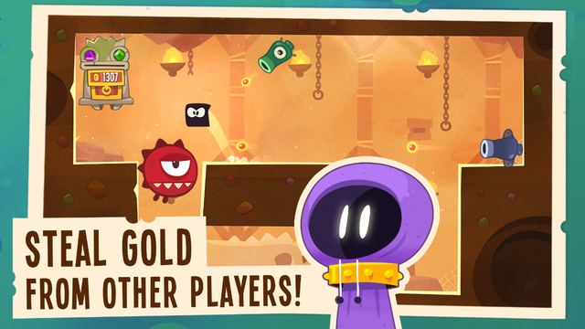

It is Simple
------------
The character is a black squre with eyes. 
It is a tap tap game, the character is controlled by tap. tap to jump, tap to change moving direction when the character touches the wall.

Charge1: Player's Design are Variousness
-------------------------------
Every player get a room as secret base, they can enter other one's room to steal golds and ruby. 
You can buy the trap suit from mall and place the them to kill the invaders. different suit includes different traps, the amount of traps are restricted, you are allowed to use 1 suit at 1 time only. 
After you finish designing the room with traps, you must pass these traps 2 turns to prove that you don't obstruct the whole road, the others have the opportunity to steal something.

Charge2: Steal the Ruby
----------------------
When you steal others, you can use props to change the game be easier, such as character copies, slow time and break trap etc, these props are sell in mall. 
After you pass all traps and touch the ruby chest, you have opportunity to steal 1 ruby. the opportunity is decrease along with the times you die, so use props to reduce your death is good choice. 
In case you don't win the ruby, you can pay for rolling the dice again and again.

Charge3: Ruby Combination
-------------------------
The game's goal is to combine better ruby, 2 ruby can combine to a better quality one. 
Ruby合成时需要消耗一定时间，这就留给其他人偷取ruby的机会。如果你不想合成中的宝石被偷掉，可以花钱立即完成合成进程。

Charge4: Cloth Combination
--------------------------
角色的外观是通过材料合成的。材料只有4种，可以从商城购买。 
不直接从商城出售外观成品的原因，主要是可以在PVE中发放部分种类的材料。如果合成配方和角色等级相关，还可以促进玩家在每个等级段的外观消费。

PVP: Revenge
------------
游戏的对抗是随机到某一个玩家的基地进行偷取，困难的陷阱会将入侵者杀死多次，这些杀伤数可以给基地增加收益。 
玩家会在上线后收到基地入侵通知，如果ruby被偷取，必然报复性的去偷取对方。假如通关后没有抽中仇人的ruby，由于愤怒和不甘必然消费进行多次抽取。

Game Pace
---------
为了控制玩家长时间的连续攻击他人，进入基地偷取前需要用手头的钥匙打开基地的锁。一扇门有很多把锁，玩家一定时间里只有有限的钥匙去试锁，因此玩家偷取次数就被控制了。 
基地的钥匙数量和门上的锁数量都可以通过升级基地提高。 
另外，低保设计，为了让死亡多次的玩家完成偷取，系统会禁用1个陷阱来降低关卡难度，保证不购买道具也可以通关。

PVE
---
这里PVE特指不花RMB的功能点。 
基地中的陷阱是可以通过gold升级的，升级后会对死亡造成更多伤害，更快的降低别人抽到ruby的概率。 
地图上还有很多策划预设的关卡，通过这些预设关卡刷gold，来对基地进行升级。

